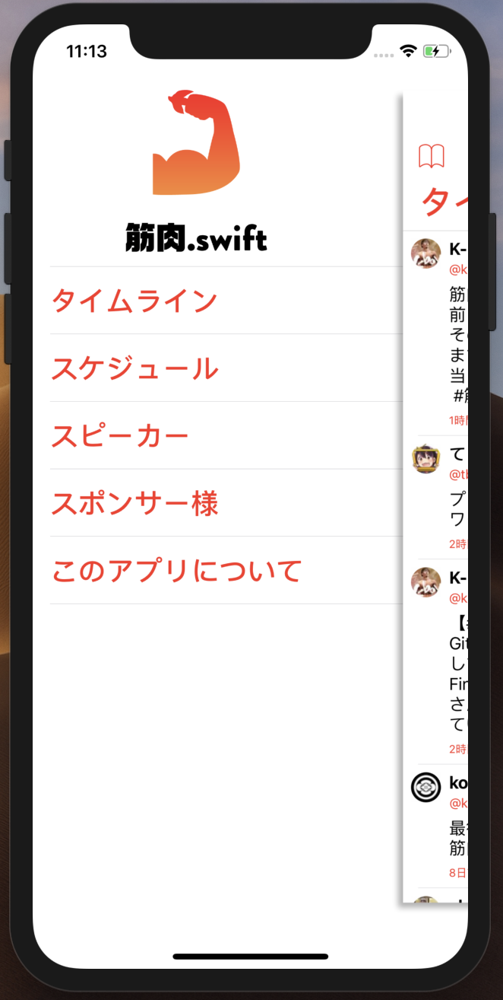
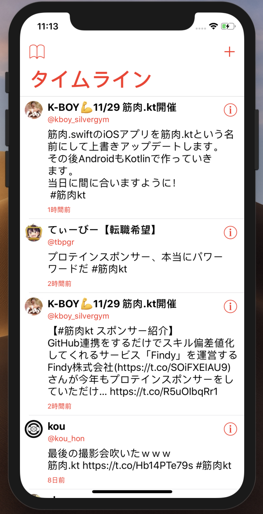
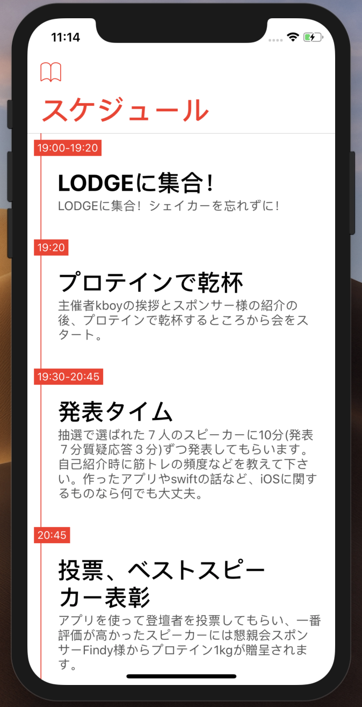
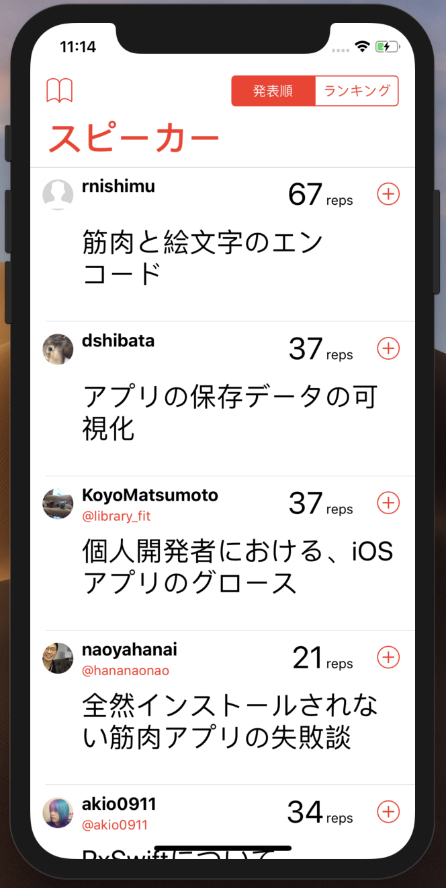
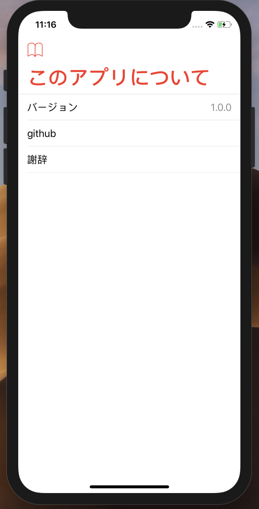

# ver 2.0 筋肉.kt

Comming Soon...

# ver. 1.0 筋肉.swift

## About
The developer conference for Muscle Engineers who are good at swift development.

[筋肉.swift #1 - connpass](https://kinniku-swift.connpass.com/event/69438/)

## App

- The data is stored in  Firebase Firestore.
- Push Notification system is using Firebase Cloud Messaging.
- Swift 4.0

|Login|Menu|Twitter Timeline|Schedule|
|:--:|:--:|:--:|:--:|
|||||

|Speaker List|Sponsor List|About|Info|
|:--:|:--:|:--:|:--:|
|||||

## Media
- [筋肉.swiftに行ってあまりにヤバかったこと10選 | Findy Engineer Lab](https://findy-code.io/engineer-lab/kinniku-swift-yabai-10)
- [筋肉エンジニアが集まる「筋肉.swift #1」 が開催！筋肉でアプリをビルドする人達 #筋肉swift | togetter](https://togetter.com/li/1176732)
- [#筋肉swift | Twitter](https://twitter.com/hashtag/%E7%AD%8B%E8%82%89swift)
